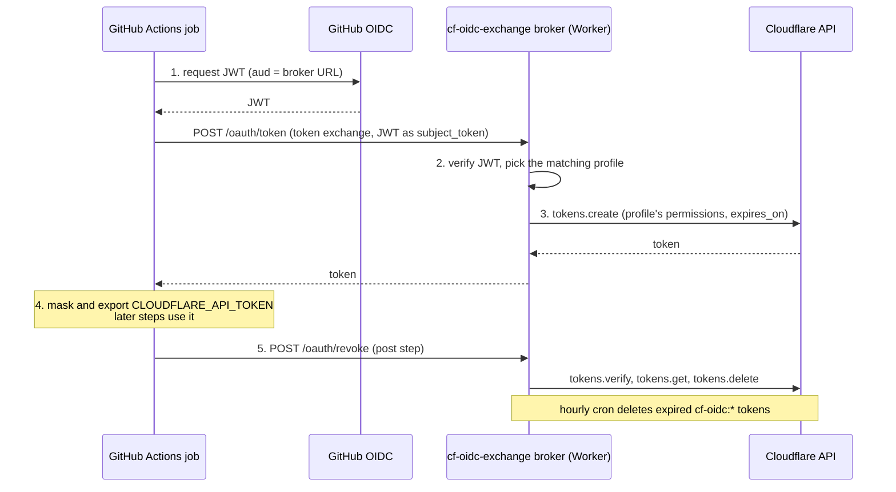

# cf-oidc-exchange

> Keyless Cloudflare API access from GitHub Actions: a job trades its GitHub
> OIDC token for a short-lived, least-privilege Cloudflare API token, so no
> workflow stores a `CLOUDFLARE_API_TOKEN` secret.

[](https://github.com/cf-contrib/cf-oidc-exchange/actions/workflows/ci.yml)
[](https://www.typescriptlang.org/)
[](https://nixos.wiki/wiki/Flakes)
[](LICENSE)

> [!NOTE]
> **Pre-1.0.** The policy format and the broker API may still change between
> minor versions. cf-oidc-exchange fills a gap until Cloudflare trusts GitHub's OIDC
> issuer natively. When it does, swap the action and delete the broker.

```yaml
permissions:
  id-token: write

steps:
  - uses: cf-contrib/cf-oidc-exchange@v0.8.0 # x-release-please-version
    with:
      broker-url: https://cf-oidc-exchange.example.com
      profile: workers-deploy
  - run: npx wrangler deploy # CLOUDFLARE_API_TOKEN + CLOUDFLARE_ACCOUNT_ID are set
```

| Component | Ships as | What it is |
|---|---|---|
| [Action](packages/cf-oidc-action) | `uses: cf-contrib/cf-oidc-exchange@<version>` | Gets the job's OIDC token, exports the minted Cloudflare token, and revokes it at job end. No runtime dependencies. |
| [Broker](crates/cf-oidc-exchange-api) | A Rust Worker in [Releases](https://github.com/cf-contrib/cf-oidc-exchange/releases), deployed with the [Terraform module](deployment/terraform) | A Worker in your account that checks the OIDC token against your policy and mints the Cloudflare token. |

The action and the broker, with its Terraform module, are released together from one tag, so deploy the broker from the release whose action you use. The action talks only to the broker, never to the Cloudflare API.

People can get credentials too, for example to run `tofu plan` locally against the shared state bucket. [gh-cloudflare](https://github.com/gh-extensions/gh-cloudflare) sends their `gh auth token` to the broker, which checks their role on the repo with GitHub and matches the profiles of the [`https://github.com` provider](crates/cf-oidc-exchange-api#people).

Other services can trust the broker too. A profile with an `audience` gets the caller a short-lived token the broker signs itself, for that service, which verifies it with the broker's published keys. [cf-nix-cache](https://github.com/cf-contrib/cf-nix-cache) is the first such service. See [Tokens for other services](crates/cf-oidc-exchange-api#tokens-for-other-services).

## How it works



The only long-lived credential is the **broker token**: an account-owned token with **Account API Tokens Write**, plus R2 permissions if profiles hand out [prefix-limited R2 credentials](crates/cf-oidc-exchange-api#buckets) (e.g. one shared Terraform-state bucket, each repo limited to its own prefix). It lives in Cloudflare Secrets Store, bound to the Worker, so it never passes through Terraform or CI and never leaves the Worker.

## Do you need it?

A stored `CLOUDFLARE_API_TOKEN` never expires unless someone rotates it. It's usually over-scoped, anyone who can run a workflow that reads it can exfiltrate it, and nothing links a job to what the token did.

| Approach | Secret in GitHub | Token lifetime | Notes |
|---|---|---|---|
| API token as a GitHub secret | yes | long-lived | The status quo |
| Token in AWS/GCP Secret Manager, read via their OIDC | no | long-lived | Fine if you already use AWS/GCP; the Cloudflare token is still long-lived |
| [bounded-systems/cf-oidc-token-broker](https://github.com/bounded-systems/cf-oidc-token-broker) | no | short-lived | Same idea. The policy is code you edit and redeploy |
| **cf-oidc-exchange** | **no** | **short-lived** | Declarative policy, prebuilt release, automatic revoke |

If a stored secret is acceptable to you, it's less to run.

## Quick start

1. **Create the broker token.** In the Cloudflare dashboard, create an account-owned API token with **Account API Tokens Write** (plus R2 permissions for [buckets](crates/cf-oidc-exchange-api#buckets)), and store it in Secrets Store.
2. **Write a policy** that says which repos, branches and environments get which permissions. See the [broker's README](crates/cf-oidc-exchange-api#policy).
3. **Deploy the broker** with the [Terraform module](deployment/terraform), on workers.dev (a custom domain is optional), then check that `<broker-url>/healthz` returns `200`.
4. **Add the action** to a job with `permissions: id-token: write`. See the [action's README](packages/cf-oidc-action).

## Development

Everything runs inside the dev shell: `nix develop`, or the Dev Container.

```sh
pnpm install && pnpm lint && pnpm typecheck && pnpm test   # the action
cargo test                                                  # the broker's unit tests
crates/cf-oidc-exchange-api/tests/run.sh                    # the broker end to end, under wrangler dev
(cd deployment/terraform && tofu test)                      # the Terraform module
```

| Directory | |
|---|---|
| [`packages/cf-oidc-action`](packages/cf-oidc-action) | The action, in JavaScript with no runtime dependencies. |
| [`crates/cf-oidc-exchange-api`](crates/cf-oidc-exchange-api) | The broker, a Rust Worker. |
| [`crates/cf-oidc-exchange-sdk`](crates/cf-oidc-exchange-sdk) | The broker's API, generated from its OpenAPI document. |
| [`deployment/terraform`](deployment/terraform) | The Terraform module that deploys the broker. |

Releases are cut by release-please from Conventional Commits. Each release is tagged `vX.Y.Z` and attaches the broker's `entry.js`, `index.js`, `index_bg.wasm.base64` and their `SHA256SUMS`. Pin the action to a release tag or its commit SHA: before 1.0 there is no floating major tag, because minor releases may break.

## License

[MIT](LICENSE)
